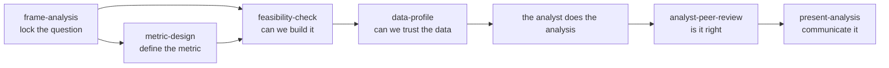

# data-analyst Plugin

Seven skills covering the full lifecycle of a data analysis: framing the right question, defining metrics that survive being optimized, checking whether the work is feasible, verifying the data is fit for purpose, reviewing the analysis itself, and turning it into a report a stakeholder can act on.

## What's Included

- **7 Skills**: analytics-guidelines (shared reference), frame-analysis, metric-design, feasibility-check, data-profile, analyst-peer-review, present-analysis
- **0 Commands**: every skill is directly user-invocable

## The lifecycle



Not every analysis needs all six workflow skills. A quick one-off query might only need `analyst-peer-review` before it ships. A new dashboard number might start at `metric-design`. Use whichever stage matches where you actually are.

## Skills

### analytics-guidelines

The lifecycle map and the shared library the other six skills read from — analytics traps, SQL pitfalls, statistical pitfalls, and report-voice rules live here once instead of being duplicated across skills. Not typically invoked directly; the other skills link into its `resources/` guides.

### frame-analysis

Turns a vague stakeholder ask into a locked question, a set of testable hypotheses (including the null one), precisely defined metrics, and a concrete plan — before any query gets written.

**Triggers:**
- "Help me frame this analysis"
- "What should I actually analyze here"
- "Someone asked me to look into X"
- Handing it a loose stakeholder request with no clear question yet

**What it does:**
1. Gathers the ask verbatim, who asked, the decision it serves, and existing context
2. Runs the decision test: would any plausible answer actually change what the stakeholder does?
3. Builds a hypotheses table, including the boring/null explanation, each with a falsifier
4. Names the metrics needed, precisely defined or flagged for `metric-design`
5. Delivers an analysis brief and offers to save it

**Example usage:**
```
Help me frame this: marketing wants to know why signups dropped last month
```

### metric-design

Defines a metric or metric tree precisely enough to survive being optimized against — a plain-language spec, source verification against the actual code, and a stress test for gaming, sensitivity, and mix shift.

**Triggers:**
- "Help me define this metric"
- "What should our north star be"
- "Is this metric any good"
- "Build a metric tree for X"

**What it does:**
1. Gathers the goal, the behavior it should drive, the owner, and existing metrics to reconcile with
2. Builds a metric tree: goal → primary metric → driver metrics → guardrail metrics
3. Writes a spec card per metric (definition, population, grain, source, direction, known gaming vectors)
4. Stress-tests each metric for Goodhart risk, sensitivity, attribution, mix-shift vulnerability, and ratio-vs-volume traps
5. Names the weakest metric in the tree explicitly

**Example usage:**
```
Build a metric tree for whether our support team is actually helping customers
```

### feasibility-check

Pressure-tests whether a proposed change is feasible, and at what cost, before anyone commits to building it or promises an estimate. Reads the real system the work would plug into rather than guessing from the plan.

**Triggers:**
- "Is this feasible"
- "How hard would this be"
- "Estimate this"
- "Can we build this"

**What it does:**
1. Locks the goal and surfaces the business unknowns the code can't answer
2. Traces the actual data path: source → filters → transforms → aggregation → outputs → consumers
3. Builds a breakdown table tagging each piece of work as have it / build it / can't / unknown
4. Names the single biggest unknown and estimates in coarse bands, never over an open unknown
5. Delivers a three-zone verdict (the call, the breakdown, the next move) and offers to save a stakeholder-safe brief

**Example usage:**
```
Is it feasible to show daily watch-time by traffic source for every video?
```

### data-profile

A read-only data quality and fit-for-purpose check on a specific table, dataframe, CSV, or Parquet file before it's used in an analysis. Never writes to a data source.

**Triggers:**
- "Check this data before I use it"
- "Profile this table"
- "Is this data reliable"
- "What's the grain of this table"

**What it does:**
1. Confirms which analysis the data is for and which columns actually matter
2. Profiles grain/key uniqueness, row counts over time, freshness, nulls, cardinality, sentinel values, outliers, join integrity, timezones, and test/internal accounts
3. Runs checks locally with duckdb/pandas for files, or generates SQL for warehouse tables when no configured access exists
4. Delivers a Trust it / Use with care / Don't use yet verdict with a checks table and one next action

**Example usage:**
```
Profile the user_events table before I build weekly active users by plan tier on it
```

### analyst-peer-review

Analytical peer review that challenges the logic, assumptions, and business reasoning behind SQL, Python, or notebook-based analysis — first verifying the numbers, then challenging whether the analysis serves its purpose.

**Triggers:**
- "Review my analysis"
- "Sanity check this query"
- "Is this analysis right"
- "Peer review this notebook"

**What it does:**
1. Gathers the question, audience, and constraints behind the code
2. Maps the logic chain from source to interpretation
3. Checks code mechanics first (joins, grain, NULLs, dates) — a correctness issue stops the review here
4. If mechanics hold, pressure-tests the analytical framing: right question, correct interpretation, blind spots, does the "so what" hold up
5. Delivers a Ship it / Think on it / Fix first verdict with at most 3 findings and one question to sit with

**Example usage:**
```
Review my week-over-week active user query before I send it out
```

### present-analysis

Turns a finished analysis into a layered Markdown report that works at three reading depths: the skimmer who reads only the takeaways, the skeptic who checks the charts, and the analyst who clicks through to the notebook.

**Triggers:**
- "Write this up"
- "Turn this into a report"
- "Summarize this analysis for stakeholders"
- "Make this presentable"

**What it does:**
1. Locks the stakeholder question the analysis answers
2. Finds the analysis and pulls the charts that actually back each takeaway (extracting embedded notebook charts to files when needed)
3. Writes Objective, Key Takeaways, Recommendations, and Analysis sections in plain, numbers-first, jargon-free language
4. Saves the report as a file and reports back only the path and a short "before you publish" note

**Example usage:**
```
Write this up for the exec team: should we invest more in mobile onboarding?
```

## Features

- Every workflow skill opens with a gate that asks for what can't be inferred, and refuses to proceed on a guessed-at goal or question.
- Shared checklists (analytics traps, SQL pitfalls, stats pitfalls, report voice) live once in `analytics-guidelines` and are linked from every skill that needs them.
- All data access is read-only. `data-profile` and `feasibility-check` never write to a data source.
- Every skill that produces a saved artifact asks before writing, gets the real date with `date +%F`, and uses a dated, descriptive filename in `docs/`.
