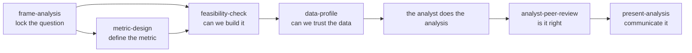

# Analytics guidelines

This skill is the map of the data-analyst plugin and the home for checklists that would otherwise be duplicated across skills. It has no delivery format of its own — the other six skills link into its `resources/` guides instead of repeating their content.

## The lifecycle

| Stage | Skill | Question it answers |
| --- | --- | --- |
| 1. Frame | `frame-analysis` | What exactly is being asked, and would any answer change a decision? |
| 2. Define | `metric-design` | What does the metric mean, precisely, and can it be gamed? |
| 3. Scope | `feasibility-check` | Can this be built on the current system, and at what cost? |
| 4. Trust | `data-profile` | Is the data this analysis depends on actually fit for purpose? |
| 5. Build | — (the analyst writes the code) | — |
| 6. Verify | `analyst-peer-review` | Is the analysis correct and does it serve its purpose? |
| 7. Communicate | `present-analysis` | Will the stakeholder read this the way it's meant? |

Not every analysis needs all seven stages. A quick one-off query might only need `analyst-peer-review` before it goes out. A new dashboard metric might start at `metric-design`. Use judgment — these are stages to reach for, not a mandatory pipeline.

## Shared resources

- [analytics-traps.md](resources/analytics-traps.md) — join fan-out, grain mismatches, NULL handling, temporal boundary errors, survivorship bias, Simpson's paradox, mix shift, denominator drift.
- [sql-pitfalls.md](resources/sql-pitfalls.md) — NULL semantics, `COUNT(col)` vs `COUNT(*)`, integer division, `LEFT JOIN` silently turned into an inner join by a `WHERE` clause, window frame edge cases, timezone bugs, and sanity queries to run before and after a join.
- [stats-pitfalls.md](resources/stats-pitfalls.md) — sample size and power, confidence intervals over bare p-values, multiple comparisons, mean vs. distribution, heavy tails, ratio metric variance, base rates, correlation vs. causation.
- [report-voice.md](resources/report-voice.md) — plain language, numbers over adjectives, bolding discipline, no em dashes or emojis, chart-heading-as-takeaway.

## For skill authors

When a workflow skill needs a checklist that already lives here, link to it with a relative path (for example, `../analytics-guidelines/resources/analytics-traps.md`) and keep only a one- or two-line summary inline. If you find yourself writing the same trap list in two skills, move it here instead.
